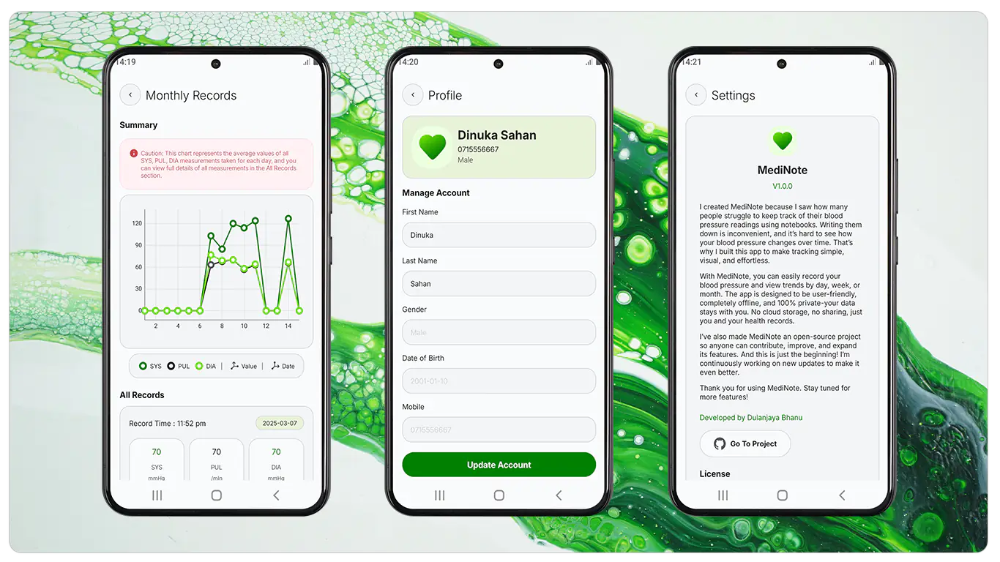

<div align="center">
    
</div>

<br/>

<div align="center">
    <a href="https://github.com/your-repository-link">Release</a> |
    <a href="https://your-docs-link.com"></a> |
    <a href="https://your-community-link.com">Community</a>
</div>

<br/>

<div align="center">
    <strong>A simple and efficient offline app for tracking and visualizing blood pressure measurements.</strong>
    <br>
    Medinote helps users record, analyze, and manage their blood pressure data with an intuitive and modern interface.
    <br/>
</div>

<br/>

## What is Medinote?

**Medinote** is an Android application designed to help users track and visualize their blood pressure measurements effortlessly. Many people struggle with manually recording their readings in notebooks, making it difficult to observe trends over time. **Medinote** provides a **fast, secure, and fully offline solution** to this problem.

The app is **open-source**, meaning anyone can contribute and help improve its functionality.

## Features  

<div align="left">
  
</div>

### User Management  
Medinote supports **multiple user accounts**, allowing different users to track their own blood pressure measurements separately. To create an account, users need to provide basic details including **first name, last name, gender, mobile number, and a secure 4-digit password**.  

Users also have complete control over their data. If they choose to **delete their account**, all associated blood pressure measurements and personal details will be permanently removed from the system. There is no cloud backup, ensuring complete privacy.  

### Blood Pressure Tracking  
Recording blood pressure measurements in Medinote is simple and efficient. The app provides three main input fields for the key parameters measured by a **blood pressure monitor**:  

- **SYS (Systolic pressure)** – The pressure in blood vessels when the heart beats.  
- **DIA (Diastolic pressure)** – The pressure in blood vessels when the heart is at rest.  
- **PUL (Pulse rate)** – The number of heartbeats per minute.  

To make the input process even smoother, users can **fine-tune each value using up and down buttons** instead of manually typing numbers. This speeds up data entry, especially for elderly users or those who need frequent recordings.  

Once a measurement is entered, users can save their record with a **single tap**. However, to maintain accuracy and prevent unnecessary duplicate entries, the app enforces a **15-minute interval between consecutive measurements**.  

### Data Visualization  

<div align="left">
  
</div>

One of the key challenges for patients tracking blood pressure manually is understanding how their readings change over time. Medinote solves this by providing **clear, easy-to-read visual charts** for recorded measurements.  

Users can analyze their data over different time frames:  

- **Daily View** – Check all individual measurements taken throughout the day.  
- **Weekly View** – See trends and averages for each week.  
- **Monthly View** – Get a broader perspective of long-term blood pressure changes.  

With **graphical charts**, users can easily identify patterns, detect fluctuations, and monitor improvements or concerns in their blood pressure trends.  

### Privacy & Offline Access  
Medinote is built with **privacy as a top priority**. Unlike many modern apps, it is designed to be **100% offline**, meaning that:  

- No internet connection is required to use the app.  
- No user data is collected, stored on external servers, or shared with third parties.  
- All recorded data stays **securely on the user’s device**, giving users complete control over their personal health records.  

This ensures that users can track their health without any privacy concerns.  

### Optimized Data Processing  
Handling large amounts of health data efficiently is crucial for performance. Medinote features a **specialized data processing algorithm** that optimizes how measurement records are stored and retrieved.  

The app organizes blood pressure readings into **11 different structured data sets**, which are converted into **JSON format** for fast and efficient access.  

For **weekly and monthly reports**, the algorithm:  
1. **Collects all relevant data** for the selected date range.  
2. **Calculates the average** of SYS, DIA, and PUL values to provide meaningful summaries.  
3. **Generates structured JSON data**, which is then used for chart visualization.  

This approach ensures that users can view their historical data instantly without waiting for lengthy calculations.  

### File Management & Performance Optimization  
To maintain app performance, Medinote uses a **custom-built "Data Baker" class** that manages all file-related tasks. The app stores user data using a **structured file tree system**, reducing redundant processing and improving access speed.  

Key advantages of this system:  

- **Efficient file handling** – JSON files store pre-processed data, so the app doesn’t need to repeatedly calculate historical summaries.  
- **Auto-recovery feature** – If a data file is accidentally deleted, the **Data Baker class automatically detects the missing file and recovers it** to prevent data loss.  
- **Local file caching** – Instead of reloading and reprocessing data every time a user opens the app, Medinote retrieves data from the pre-saved files. This significantly reduces processing time and enhances overall performance.  

By leveraging **structured data storage and caching mechanisms**, Medinote ensures a **smooth and lag-free user experience**, even for users with extensive measurement history.  

### Modern UI/UX  
Medinote is designed with **ease of use in mind**, following **modern UI/UX design principles** to ensure a clean, intuitive interface.  

- The **home screen** provides quick access to **measurement recording and visualization tools**.  
- The **navigation system** makes it easy to switch between different views, from entering new data to reviewing past records.  
- All buttons and input fields are designed to be **large and easily tappable**, making the app accessible even for users with limited dexterity.  

The app’s design ensures that **any user—regardless of age or technical experience—can use Medinote comfortably**.  

### Android Compatibility  
- **Minimum Android Version:** Android Nougat (API Level 24)  
- **Supported Devices:** Smartphones and tablets running Android 7.0 (Nougat) and above  

## Getting Started
Clone the Repository

To get a copy of Medinote, run:

```sh
git clone https://github.com/your-repository-link.git
cd Medinote
```

## Build & Run
1. Open the project in Android Studio.
2. Sync the Gradle files and install dependencies.
3. Build and run the application on an emulator or physical device.

## Contribution

<div align="left">
  
</div>

Medinote is an open-source project, and we welcome contributions from developers worldwide. If you want to contribute:

1. Fork the repository.
2. Create a new branch (feature-branch).
3. Commit your changes.
4. Push the changes and create a pull request.
5. For more details, check the CONTRIBUTING.md.

## License
Medinote is licensed under the MIT License. See the [LICENSE](LICENSE) file for more details.
